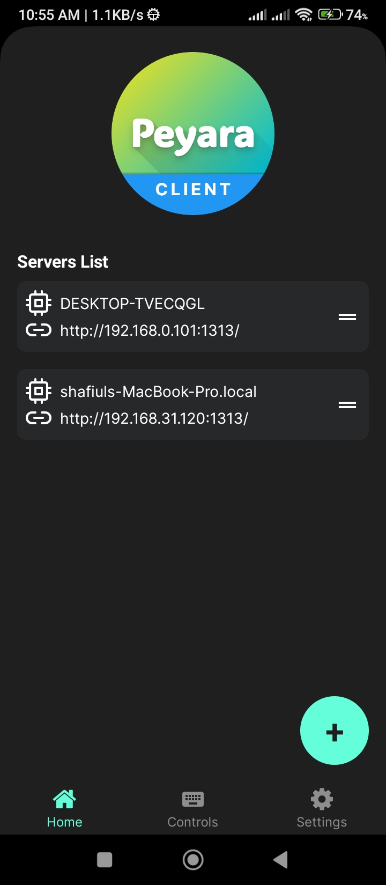
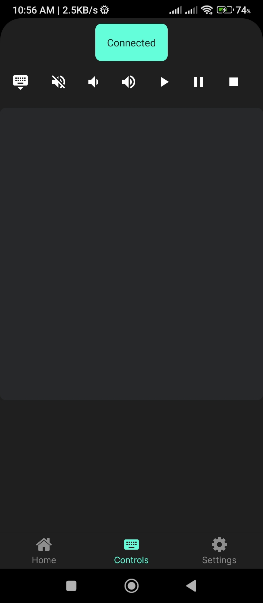

## Peyara Remote Mouse & Keyboard Mobile Client

An open source cross platform mobile client providing touchpad, keyboard and media controls for wirelessly controlling desktop.

---

### Getting Started

Download Peyara Remote Desktop Client on windows /mac OS/ linux

[From the Official Website](https://peyara-remote-mouse.vercel.app/)

Install the desktop client and start the server.

Scan the QRCode and connect!

Follow the initial onboarding steps to get started!

### Connectivity Features

- Easy and effortless QRCode scanning
- Automatic server detection
- Fast device switching

### Touchpad Features

- Single Tap
- Double Tap
- Right Click on Two Finger Tap
- Two Finger Scroll Gesture
- Three Finger Gesture for click and drag

### Keyboard Features

- Use virtual keyboard to input basic text

### Media Features

- Control Media volume
- Control Audio play, pause, stop, previous, next track

